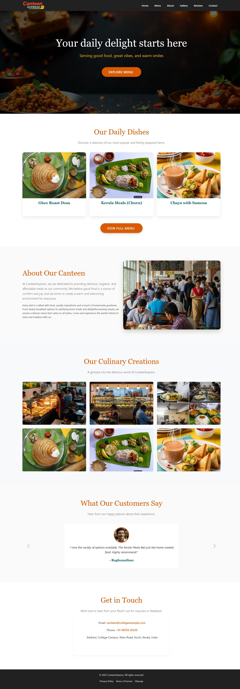
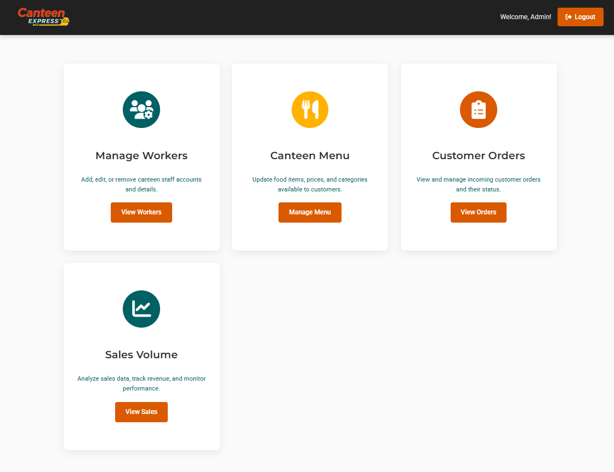
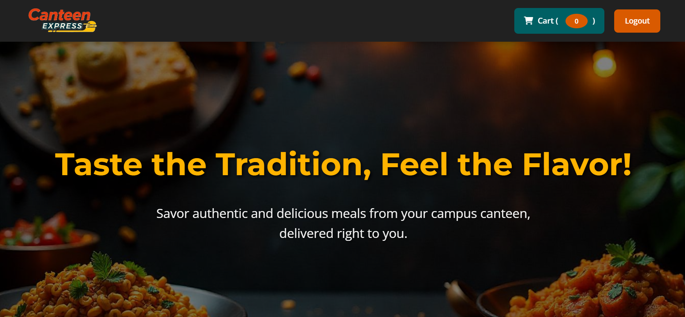

# CanteenExpress – Canteen Management System

**CanteenExpress** is a full-featured, web-based Canteen Management System (CMS) designed to digitalize and streamline the food ordering and administrative operations of a canteen. The system caters to both **regular customers** as end users and **canteen administrators** as system managers.

---

**[Visit Project-Landing Page](https://darsana-ramesh.github.io/CanteenExpress/)**

## Screenshots

<table>
  <tr>
    <td>
       
      <strong>Landing Page</strong>
    </td>
    <td>
       
      <strong>Admin DashBoard</strong>
    </td>
    <td>
       
      <strong>User Page</strong>
    </td>
  </tr>
</table>

## Project Summary

This project report outlines the complete life cycle of the **CanteenExpress** application — including its design, implementation, and performance evaluation. The system offers:

- A **user-facing interface** for browsing food menus and placing orders.
- An **admin dashboard** for managing food items, workers, and reviewing sales analytics.

The backend is supported by a well-structured **relational database schema**, leveraging normalization and optimized SQL queries to ensure efficiency, scalability, and integrity of operations.

---

## Objectives

- Facilitate digital ordering for canteen users
- Centralize food, order, and worker management for administrators
- Enable data-driven decisions through sales reporting
- Enhance user experience through responsive and secure web technologies

---

## Functional Overview

### User Functionalities

1. **User Registration & Authentication**
   - Secure account creation with details like name, email-ID, and contact info
   - Login/logout with username/email and password validation

2. **Menu Browsing & Order Placement**
   - Real-time display of available food items with prices
   - Unique `Food ID` assigned to each menu item
   - Order placement based on selected food item, quantity, and associated customer ID

---

### Admin Functionalities

1. **Food Management**
   - Add/update/delete food items including name, price, and description
   - Maintain up-to-date inventory for menu offerings

2. **Worker Management**
   - Add workers with their details and roles (name, contact, position)
   - Remove workers no longer active in the canteen staff

3. **Order Management**
   - View and track all orders with customer IDs, ordered items, quantity, price.

4. **Sales & Revenue Reporting**
   - Generate detailed reports on:
     - Quantity sold per food item
     - Revenue generated by item
     - Total sales and order volume over specified periods

---

## System Architecture

### Conceptual Data Model

The schema supports core entities such as:

- **Users**
- **Orders**
- **Food Items**
- **Workers**
- **Transactions**

Normalization techniques (up to 3NF) were applied to minimize redundancy and enhance data integrity.

---

## Non-Functional Requirements

### Software Specifications

| Component        | Specification                               |
|------------------|-------------------------------------------- |
| Operating System | Linux (Ubuntu) or Windows Server            |
| Web Server       | Apache HTTP Server                          |
| Programming      | PHP, HTML5, CSS3, JavaScript                |
| DBMS             | MySQL (with SQL for operations)             |
| Frameworks/Libs  | Bootstrap 5, Font Awesome, jQuery (optional)|

---

### Security & Performance

- Session-based user authentication and authorization
- Sanitized form inputs to prevent SQL injection
- Optimized SQL queries for fast data retrieval
- Transaction control to ensure financial and data consistency
- Mobile-first responsive UI for accessibility

---

## Developed By

**Darsana R**  

